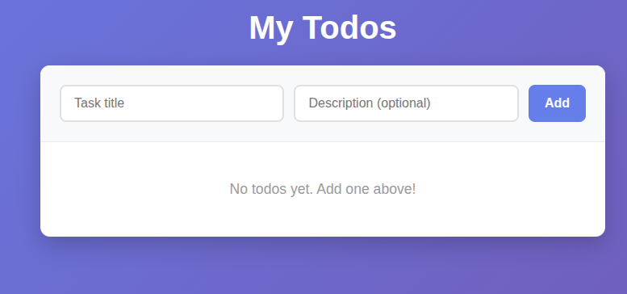

# About this app:
This app is just for learning purpose that I created. 

## Tech Stack:
Front-end: Next.js, plain CSS
Backend: Express.js (Node.js)
Database: MongoDB Atlas
API: REST
Room: CORS + dotenv 

## Architecture:
Next.js frontend → Express REST API → MongoDB Atlas

## Features:
- It doesn't have much features beside CRUD operations.

## To run the full app:
### Terminal 1:
cd todo-app/server && npm run dev

### Terminal 2:
cd todo-app/client && npm run dev

Then open http://localhost:3000

## Demo:
